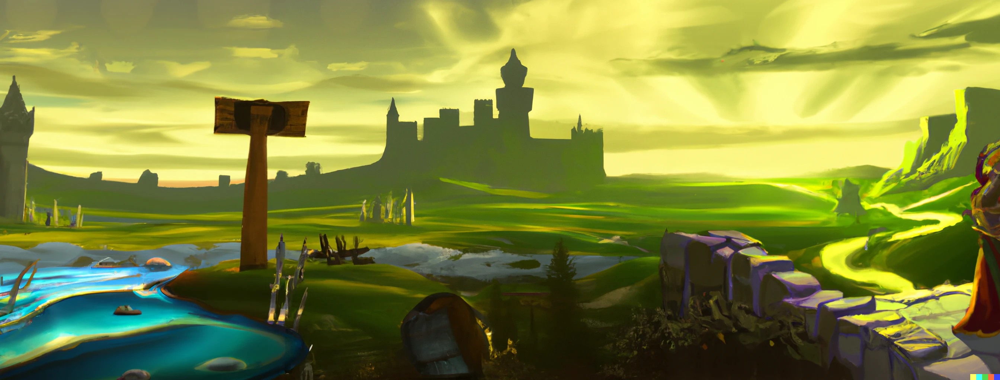

# Geneden

- [Geneden](#geneden)
  - [Contexte](#contexte)
  - [Synopsis](#synopsis)
  - [Histoire](#histoire)
- [Inspirations](#inspirations)
- [Gameplay](#gameplay)
- [Captures d'écran du jeu](#captures-décran-du-jeu)

## Contexte

Geneden est un projet de jeu vidéo réalisé en autonmne 2022 à l'UQAC dans le cadre du cours de conception et développement de jeu vidéo.
Ce jeu est réalisé en équipe de 5.

## Synopsis
Notre jeu se place initialement dans un monde sans vie qui verra par la suite, la naissance d’une civilisation et qui évoluera jusqu’à l’âge médiéval. Cette civilisation est guidée par un dieu à qui leur vie est dévouée. C’est au travers des choix et des actions de ce dieu que la civilisation devra évoluer dans un monde hostile et sauvage.

L’idée est de créer un jeu de stratégie multijoueur en ligne (1 contre 1) basé sur les éléments de l’alchimie. En effet, les joueurs s’affrontent sur un terrain vague bordé d’eau et doivent le façonner selon ses désirs à l’aide des éléments dont ils disposent afin de faire naître et prospérer une civilisation et ainsi montrer à tous qu'il est l’être éternel et unique, capable de gouverner ce monde.

## Histoire

Les dieux sont des personnages très extravagants et ô combien belliqueux. Les querelles sont d’ailleurs monnaie courante au Royaume! Mais récemment les limites ont été dépassées.

Goeyr, le père des dieux, a construit le royaume en commençant par l’obélisque d’Edenym, une tour de 100 mètres de haut, portant comme inscription le nom de tous les êtres divins parcourant ces terres. Edenym est en plein centre du Royaume, comme un symbole du lien unissant ses habitants.

Lors d’un grand banquet organisé par Atlantis, divinité de l’ivresse, alors que tous les dieux s’adonnaient à moultes jeux et débats, un grand bruit retentit dans tout le royaume. Ils sortent tous en panique et sont stupéfaits de voir, au loin, le sommet de la sculpture originelle effondré. C’était Phénox qui, sous l’influence du vin et d’un ennui profond, avait décidé de la saboter, mais personne ne le saura jamais…

Goeyr était furieux. Sa propre progéniture qui provoque l'événement le plus tragique qu’il soit, dans un soir de fête en plus? S’ils avaient décidé d’attaquer la communauté, il en convenait de leur faire comprendre que leur présence ici demandait un respect réciproque. Ainsi il se préparait à organiser un grand tournoi: le Geneden, obligeant les dieux à régler leurs querelles une bonne fois pour toute, et en même temps permettre aux plus grands de se hisser en haut du Royaume. En effet, le grand vainqueur sera représenté en haut d’Edenym, en symbole de sa force.

Lors du Geneden, Goeyr compte utiliser la planète vierge d’Aurus pour mettre à l’épreuve les compétiteurs. A l’image des dieux exemplaires qu’ils doivent chercher à devenir, leur mission est de créer la civilisation la plus développée possible. Bien sûr, les enfantillages ne sont pas finis pour autant, et il est à peu près sûr de les voir se mettre des bâtons dans les roues.

# Inspirations
Worldbox, Populous II

# Gameplay

Le jeu se présente comme RTS, Sandbox, Multijoueur et Stratégique

# Captures d'écran du jeu

TODO